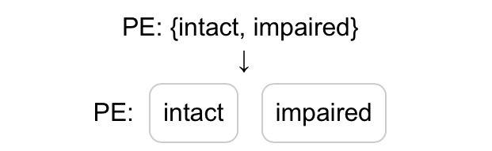

# Dynamic Web Generator

*Patrick Yi-Hong Wu*

## [Tap Here To Go](https://patrickwoolf.github.io/dynamicweb)

## Intention
- To fasten the process of note taking in a medical scenario.
- Convert text templates into selectable boxes, which could be copied and pasted on medical notes.
- Best uses: to generate any physical examinations, customer questionairres, etc. based on your needs.

- PE: \{intact, impaired\} ->
  
